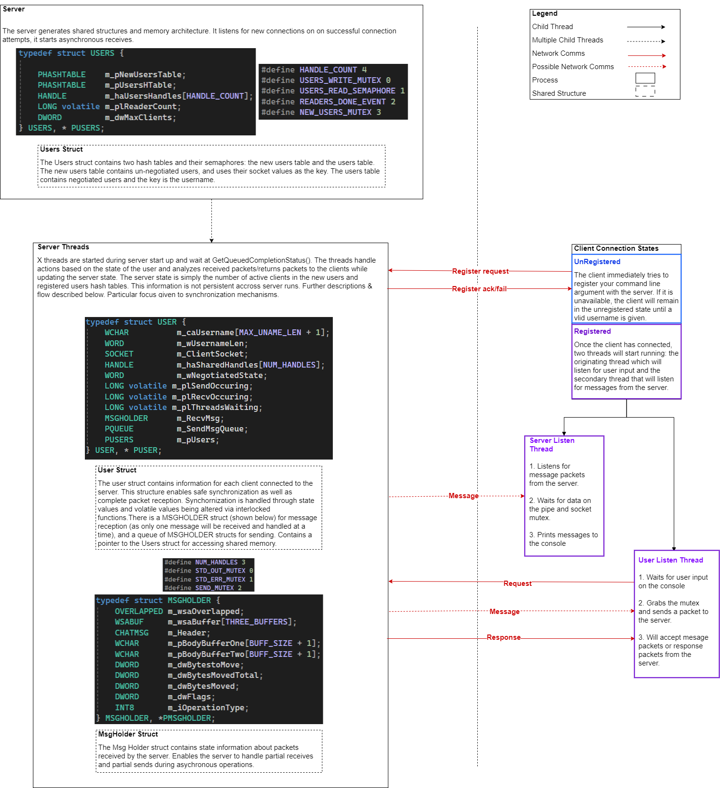
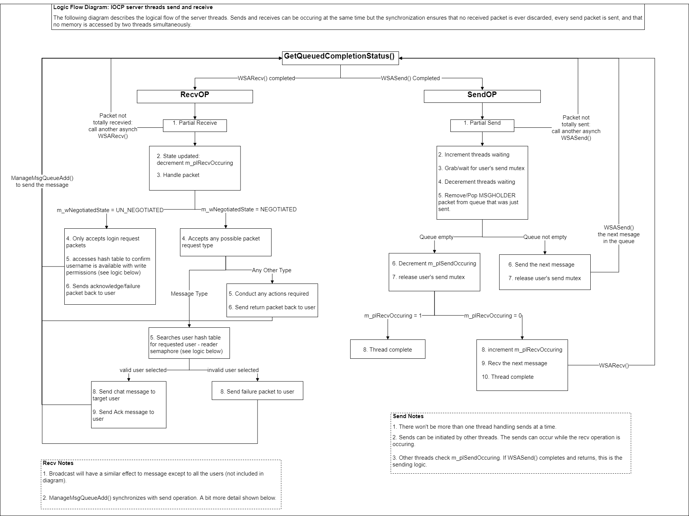
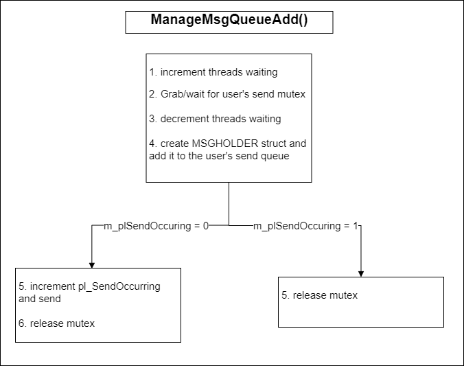
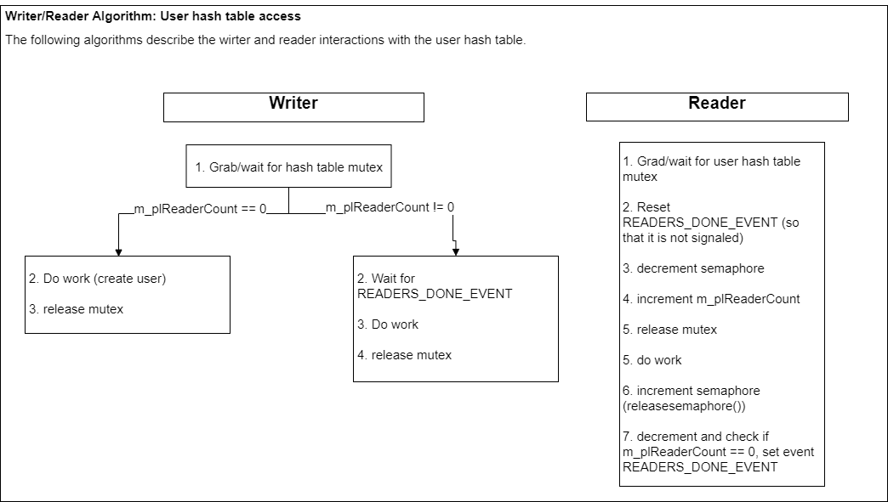

# ChatRoom
### Version 1.0

# 1. Project Overview

Please see an overview of my implementation of the Chat project below. The following section will discuss implementation decisions and capabilities of the project. The first figure describes how the client and server generally work.

The server uses IO completion ports (IOCP) for sending and receiving packets from the client. This made the logic a little more complicated, as it's essential for a user to be able to asychronously receive messages while the client is sending messages using shared memory. The second diagram demonstrates some of the server's logic. The third diagram expands upon this logic.

The fourth figure, below, just describes about how the readers and writers interact with the users hash table. The interaction enables multiple readers - which support the message, broadcast, and list functionalities whil only supporting one writer at a time - for the register/login and logout functionalities.

At the end of this README, you'll see a product backlog that is also reflected on the gitlab page.

To build the server and client executables, open the solution in Visual Studio and build each project. Since the project uses ASAN, if you want to run it in cmd prompt, use the following command to update the path first: set PATH=C:\Program Files\Microsoft Visual Studio\2022\Community\VC\Tools\MSVC\14.41.34120\bin\Hostx64\x64

See video for client/server demonstration.

*Figure 1. Chat Project Overview Flowchart.*

*Figure 2. Chat Server Logic part 1.*

*Figure 3. Chat Server Logic part 2.*

*Figure 4. User Hash Table Reader/Writer Logic.*

# 2. Message protocols

The following message protocols are used for chat room communications. Most messages have opcodes request (to the server) and acknowledge/reject (to the client), but the packet type and subtype identify what communications are occuring. If the packet is of type failure, the packet will also include a reject code. 

### 2.1 Packet type codes 

|||
|-|-|
|Account|0x00|
|Chat|0x01|
|List|0x02|
|List|0x03|
|Failure|0xFF|

 

### 2.2 Sub-types: 
|||
|-|-|
|Empty|0x00|
|Login|0x01|
|Logout|0x02|

 

### 2.3 Opcodes: 
|||
|-|-|
|Request|0x00|
|Response|0x01|
|Acknowledge|0x02|

 

### 2.4 Reject codes: 
||||
|-|-|-|
|Server Busy|0x00|Server is unable to take anymore clients|
|Server Error|0x01|An error has occured on the server|
|Invalid Packet|0x02|The server received an invalid packet|
|Username length|0x03|The username length is not in the range 1 to 30 characters|
|User logged in|0x04|Username unavailable|
|User not exist|0x05|The specified user does not exist|
|message length|0x06|The message is too long|
|server full|0x07|The server has reached max capacity|

 

# 3. Testing

Integration testing was manually, via the command line.

 

# 4. Product Backlog

1. Updated hash table m_wSize from WORD to DWORD.
2. Magic numbers used throughout
3. Potentially limit # of sends [(see notes)](#6.-notes)
4. Data is not persistant
5. Packet protocol dictates list length meet message length requirements. The limitation is currently the size of WORD, meaning that the list cannot be more than 65535 characters in length. This means that the set limit of 65535 maximum clients would certainly not fit. Not to mention the practice limitations of each login/logout broadcasting.

 

# 5. Known Bugs/Failures

1. ASAN detects memory overflows but doesn't detect memory leaks.

 

# 6. NOTES

Clients control the number of sends performed on an IOCP server because packets return on completion. The server could build up a queue of messages for a client that is staying connected but not receiving messages which could eventually take up a lot of memory on the server.

 